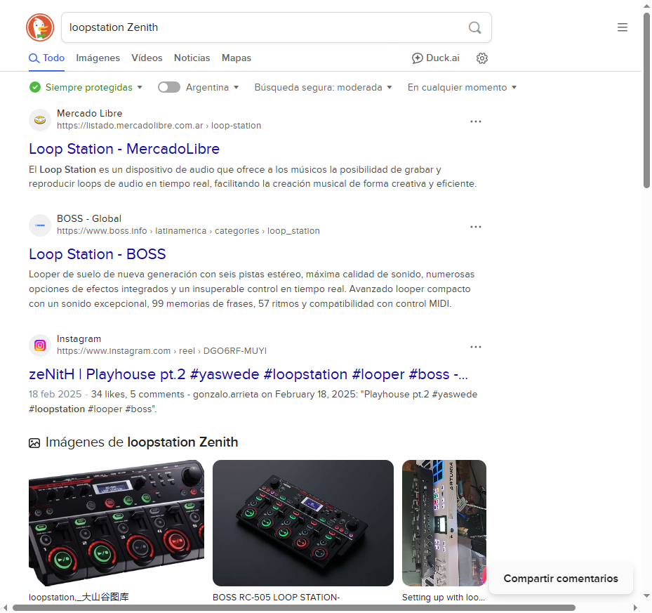

# DuckDuckGo Automation with Selenium 🐍

Este script automatiza una búsqueda en [DuckDuckGo](https://duckduckgo.com), guarda una captura de pantalla y muestra los resultados en la terminal.

### 🔧 Requisitos

- Python 3.x
- Selenium
- ChromeDriver (instalado y en el PATH)

### 🏁 Cómo usarlo

```bash
python duckduckgo_search.py
```
### 🖼 Captura generada


